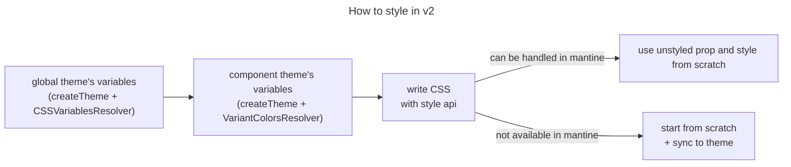

# 디자인 시스템 도입기

## v1 retrospective

1. 디자인이 나오지 않으면 병목발생
2. antd 컴포넌트에 기능, 스타일, 테스트 추가 후 통째로 관리해서 유지보수 어려움
3. inline / block 등과 같이 레이아웃 관련 스타일도 컴포넌트 내부에서 선언해서 레이아웃에 따라서 외부에서 덮어쓰기 남용
   1. e.g. modalSize: small, medium-480, medium-540, medium-560, medium, large, large-894
   2. 반응형이 고려되지 않아서 text-wrap이 적용안되거나 flex,grid 가 깨짐
4. antd 스타일 덮어쓰기 실패 → !important, :global() 선택자 남용

## v2 goal

1. 디자인이 나오지 않았더라도, 디자인이 크게 깨지지 않는 선에서 개발 가능하도록 theme 활용
2. mantine에 스타일만 추가한 core와 기능 및 테스트도 추가한 extended 별도 운영해서 유지보수 범위 명시
3. mantine의 box를 사용해서 레이아웃 관련 스타일은 외부에서만 선언
   1. 컴포넌트 내부는 width:100%, height: auto를 가지고 외부에서 크기 조절
4. theme이 지정한 스타일 그대로 활용 / 그외 custom component는 직접 작성(unstyled prop활용)

## Mantine을 선택한 이유

모든 mantine 컴포넌트는 box factory에서 생성됨

https://mantine.dev/core/box/

레이아웃 관련된 스타일들을 컴포넌트 외부에서 주입 가능하다는 것

```tsx
import { Box } from '@mantine/core'

function Demo() {
  return (
    <Box mx="auto" maw={400} c="blue.6" bg="#fff">
      Your component
    </Box>
  )
}
```

| Prop | CSS Property | Theme key     |
| ---- | ------------ | ------------- |
| m    | margin       | theme.spacing |
| mt   | marginTop    | theme.spacing |
| mb   | marginBottom | theme.spacing |
| ml   | marginLeft   | theme.spacing |

**styles api** - css 선택자 바로 주입가능해서 덮어쓰기 용이함, antd에서 걸렸던 문제

https://mantine.dev/core/button/?t=styles-api

| Selector | Static selector         | Description                                               |
| -------- | ----------------------- | --------------------------------------------------------- |
| root     | .mantine-Button-root    | Root element                                              |
| loader   | .mantine-Button-loader  | Loader component, displayed only when loading prop is set |
| inner    | .mantine-Button-inner   | Contains all other elements, child of the root element    |
| section  | .mantine-Button-section | Left and right sections of the button                     |
| label    | .mantine-Button-label   | Button children                                           |

---

## TOC

- [ui-v2](#ui-v2)
  - [Mental Modal](#mental-modal)
  - [How to implement with components](#how-to-implement-with-components)
  - [How to style components](#how-to-style-components)
    - [Steps](#steps)
    - [CSS guide](#css-guide)
  - [TODO](#todo)

FYI) all these introductions are WIP

## Mental Modal

1. Simple is the best, avoid attaching extras to components
2. Component itself should not determine itself's size & layout if possible
   - for large list of components [avoid using style props](https://mantine.dev/styles/styles-performance/#responsive-style-props)

## How to implement with components

Mantine component requires `MantineProvider` with theme so in the top level of your app(e.g. main.tsx)

FYI) we only have lightTheme for now

```tsx
import { MantineProvider } from '@mantine/core'
import { primitiveTheme, cssResolver } from '@fai/ui-v2/primitive-theme'

const root = createRoot(document.querySelector('#root') as HTMLElement)

root.render(
  <StrictMode>
    <MantineProvider
      theme={primitiveTheme}
      cssVariablesResolver={cssResolver}
      defaultColorScheme="light"
    >
      <App />
    </MantineProvider>
  </StrictMode>
)
```

At page or view level import the component themes and merge them with primitive
then provide them to `MantineThemeProvider`

```tsx
import { MantineThemeProvider, mergeThemeOverrides } from '@mantine/core'
import { primitiveTheme } from '@fai/ui-v2/primitive-theme'

import { buttonTheme } from '@fai/ui-v2/components/button'

// Note: It is better to to store theme override outside of component body
// to prevent unnecessary re-renders
const theme = mergeThemeOverrides(primitiveTheme, buttonTheme)

export function Page() {
  return (
    <MantineThemeProvider theme={theme}>
      <div className={layout}>
        <Button>Label</Button>
      </div>
    </MantineThemeProvider>
  )
}
```

## How to style components

key to use theme efficiently is to control root variables nicely, so our step will be

### Steps

1. play with [global theme's variables](https://mantine.dev/styles/css-variables-list/) + [override](https://mantine.dev/styles/css-variables/#css-variables-resolver)
2. if not worked out well, play with component theme's variables
   - check each component's affected variables + ovveride them with [css variables](https://mantine.dev/styles/variants-sizes/#sizes-with-components-css-variables)
   - if new variant needed use [variantColorsResolver](https://mantine.dev/styles/variants-sizes/#variantcolorresolver)
   - merge with global theme [mergeThemeOverrides](https://mantine.dev/theming/theme-object/#merge-multiple-theme-overrides)
3. if not worked out well, style with mantine's [style api](https://mantine.dev/styles/styles-api/) with css
4. detach the component from theme with [unstyled prop](https://mantine.dev/styles/unstyled/)
5. final step, create your own component from scratch + sync to theme using [useProps hook](https://mantine.dev/theming/default-props/#useprops-hook)



### CSS guide

[**DO NOT**] directly consume design tokens(e.g. colorTokens.json, variables.token.json) in css, inject it the global theme then use it

```ts
import { themeToVars } from '@mantine/vanilla-extract'
import { createTheme } from '@mantine/core'

const yourTheme = createTheme({
  other: {
    yourVariable: 'pink',
  },
})
// CSS variables object, can be access in *.css.ts files
export const vars = themeToVars(yourTheme)
```

then use `vars` in the `*.css.ts`

```ts
import { vars } from '@fai/ui-v2/primitive-theme'

export const active = style({
  transition: 'transform 50ms ease-in-out',

  selectors: {
    '&:active': {
      backgroundColor: vars.colors.blue[7],
    },
  },
})
```

this is to ensure all components synced with the apps theme
